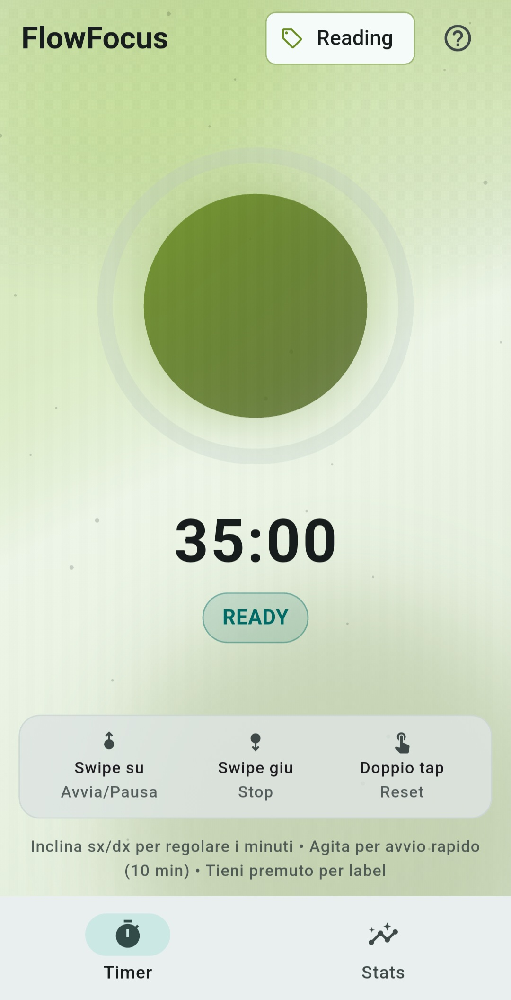
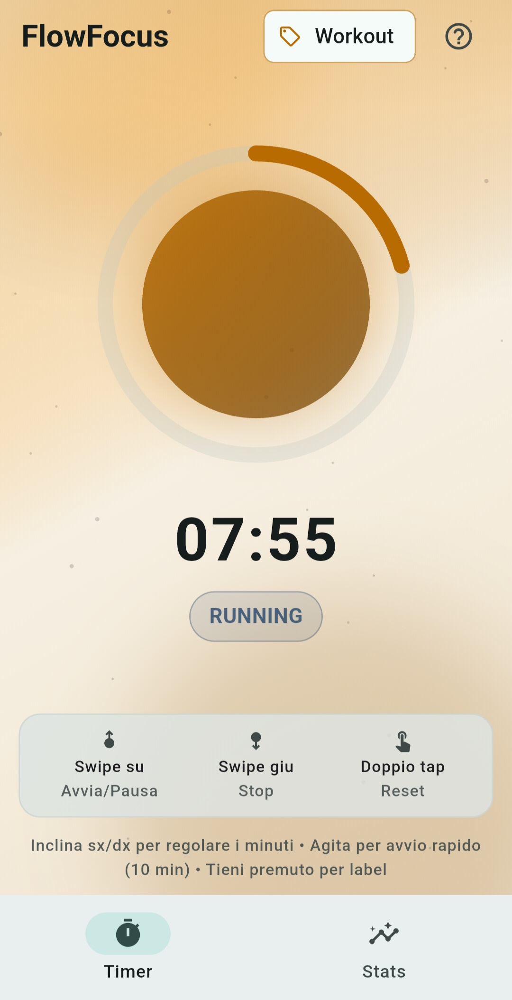
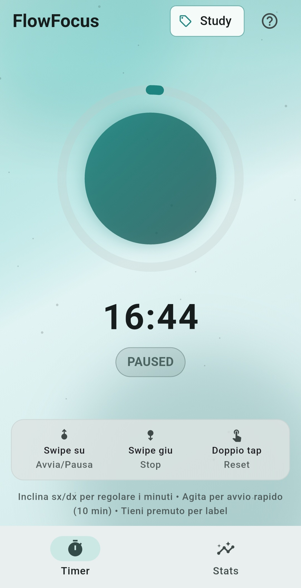
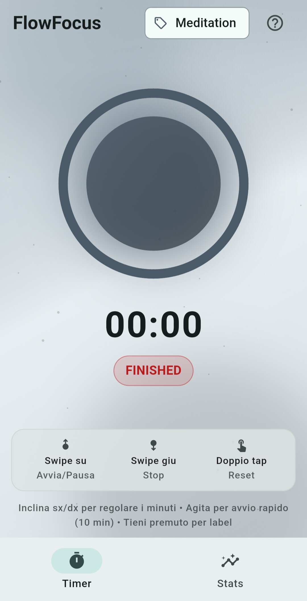
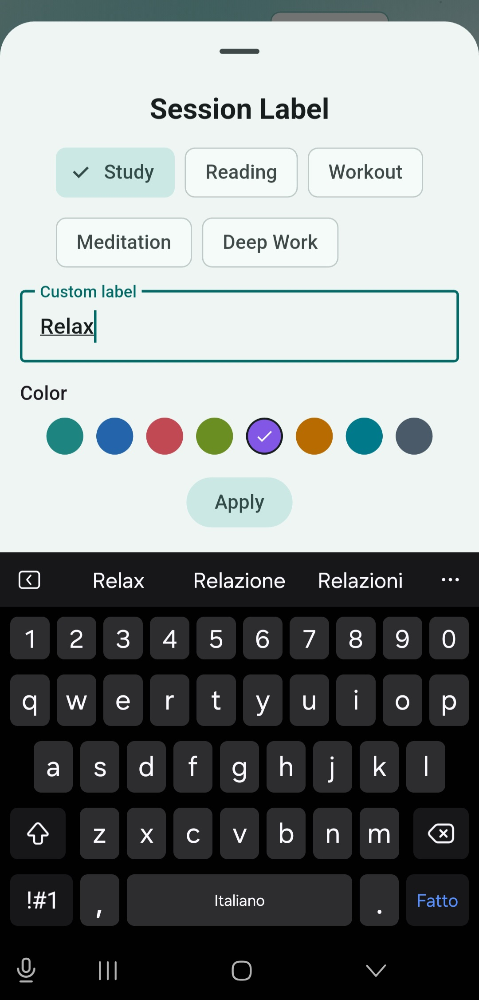
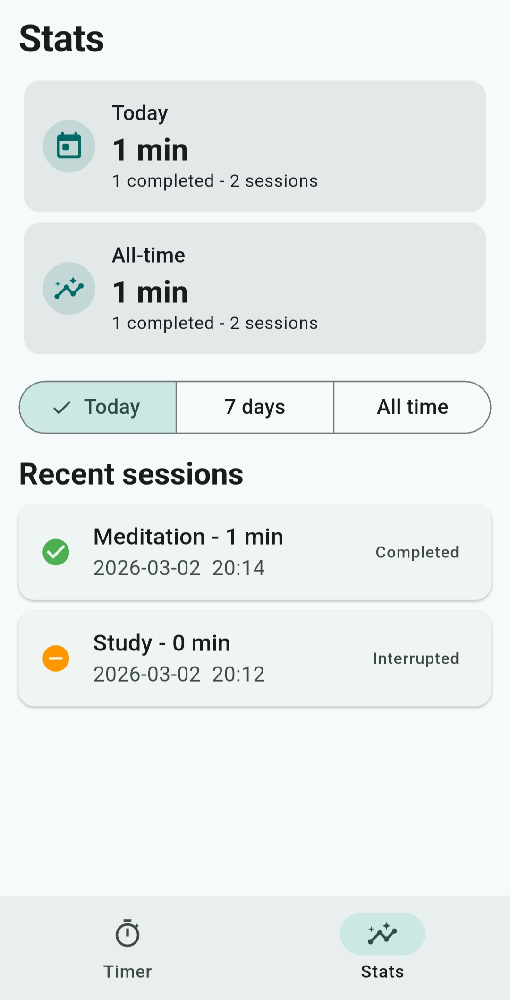

# FlowFocus - Tilt & Swipe

FlowFocus è un'app Flutter per sessioni di concentrazione con un'interazione "mobile-first": il tempo si imposta inclinando il telefono e la sessione si controlla con gesture rapide.

L'obiettivo del progetto è mantenere il codice pulito e leggibile, con UX curata (Material 3), animazioni fluide e persistenza locale leggera.

## Screenshot

### Timer - Stati principali

| READY | RUNNING |
|---|---|
|  |  |

| PAUSED | FINISHED |
|---|---|
|  |  |

### Label e statistiche

| Session Label | Stats |
|---|---|
|  |  |

## Tecnologie usate (cosa, perché, come)

### provider (state management)
`provider` viene usato per la gestione dello stato applicativo tramite `ChangeNotifier`. È una scelta adatta a un'app come FlowFocus perché evita complessità non necessaria e mantiene chiara la separazione tra logica e UI. Concretamente, `AppState` centralizza timer, sensori, sessioni, label, colori e persistenza, mentre i widget si limitano a osservare lo stato (`watch`) o invocare azioni (`read`).

### sensors_plus (accelerometro)
`sensors_plus` fornisce l'accesso allo stream dell'accelerometro, necessario per l'interazione principale dell'app. È stato scelto perché è leggero, mantenuto e perfettamente integrabile con Flutter. In pratica, in `AppState` viene aperta una subscription a `accelerometerEventStream()`: i dati vengono filtrati con low-pass per rendere il tilt stabile, usati per regolare i minuti in READY e analizzati per il rilevamento shake tramite soglia e cooldown, evitando trigger ripetuti.

### shared_preferences (persistenza locale)
`shared_preferences` gestisce la persistenza locale key-value dei dati che devono sopravvivere ai riavvii dell'app. È stata scelta perché è sufficiente per volumi piccoli/medi come cronologia sessioni e colori label, senza introdurre un database o un backend remoto. L'implementazione è incapsulata in `lib/services/session_storage.dart`, dove liste e mappe vengono serializzate in JSON in scrittura e ricostruite in lettura.

## Architettura del progetto

```text
lib/
  main.dart
  models/
    session_record.dart
    label.dart
  services/
    session_storage.dart
  state/
    app_state.dart
  screens/
    timer_screen.dart
    stats_screen.dart
  widgets/
    orb_timer.dart
    parallax_background.dart
    gesture_help_sheet.dart
    stats_cards.dart
```

### Ruoli principali
- `AppState`: logica applicativa (timer, sensori, shake, gesture outcomes, storage).
- `screens/*`: composizione UI delle tab Timer/Stats.
- `widgets/*`: componenti riusabili e animazioni.
- `services/*`: persistenza locale isolata dalla UI.

## Funzionalità implementate

### 1) Timer con stati
Stati supportati:
- `READY`
- `RUNNING`
- `PAUSED`
- `FINISHED`

Comportamento:
- countdown dalla durata selezionata
- completamento automatico a `00:00`
- stop anticipato salva sessione interrotta
- reset riporta a stato READY

### 2) Accelerometro

#### Tilt per selezione minuti
- inclinazione destra: aumenta minuti
- inclinazione sinistra: diminuisce minuti
- range: `1..60`
- rate limit per evitare scatti
- feedback aptico ogni step da 5 minuti

#### Shake quick action
- in stato READY, shake avvia sessione rapida da 10 minuti
- notifica visuale tramite snackbar
- cooldown per evitare trigger multipli ravvicinati

### 3) GestureDetector (controllo sessione)
- **Swipe su:** avvia / pausa / riprendi
- **Swipe giù:** stop (torna READY)
- **Doppio tap:** reset
- **Pressione lunga:** scelta/creazione label + colore

Sono presenti soglie di distanza e velocità per ridurre attivazioni accidentali.

### 4) Orb animata
- pulse morbido in RUNNING
- stato "fermo" in PAUSED
- glow di completamento in FINISHED
- colore guidato dalla label corrente

### 5) Label con colore personalizzato
- label predefinite + label custom
- ogni label può avere un colore
- il colore selezionato guida:
  - orb centrale
  - sfondo timer
- mappa `label -> color` salvata in locale

### 6) Statistiche
- card "Oggi"
- card "All-time"
- filtro periodo: `Today / 7 days / All time`
- lista sessioni recenti (completata/interrotta, label, minuti, data/ora)

## Persistenza dati

### Sessioni
Le sessioni vengono salvate come lista di record JSON, dove ogni elemento rappresenta una sessione conclusa o interrotta. Ogni record contiene `label`, `plannedMinutes`, `actualSeconds`, `status` (`completed` oppure `interrupted`), `startedAt` e `endedAt`. Questa struttura permette di ricostruire facilmente sia la cronologia dettagliata sia le statistiche aggregate (oggi, 7 giorni, all-time) senza logiche complesse lato storage.

### Colori label
I colori delle label sono persistiti come dizionario `Map<String, int>`, dove la chiave è il nome della label e il valore è il colore in formato ARGB (`int`). In questo modo la personalizzazione visiva resta coerente nel tempo: quando l'utente riapre l'app ritrova lo stesso colore associato alla label, che viene riapplicato sia all'orb centrale sia allo sfondo del timer.

Chiavi storage:
Le chiavi usate in `shared_preferences` sono `flowfocus_sessions` per la cronologia delle sessioni e `flowfocus_label_colors` per la mappa dei colori label. Separare le chiavi semplifica manutenzione e migrazioni future: si può evolvere una parte dei dati senza impattare l'altra.

## UX e animazioni
- Material 3 con tipografia coerente
- transizioni leggere con `AnimatedContainer` / `AnimatedOpacity`
- orb con `AnimationController`
- layout minimal e orientato a gesture, senza pulsanti principali invasivi

## Avvio progetto

## Requisiti
- Flutter SDK (consigliato canale stable)
- Device fisico consigliato per test sensori

## Installazione e run

```bash
flutter pub get
flutter run
```

## Verifica qualità

```bash
flutter analyze
flutter test
```

## Note su emulatore
- su emulator/simulator l'accelerometro può essere assente o simulato male
- per tilt/shake realistici usare un dispositivo reale
