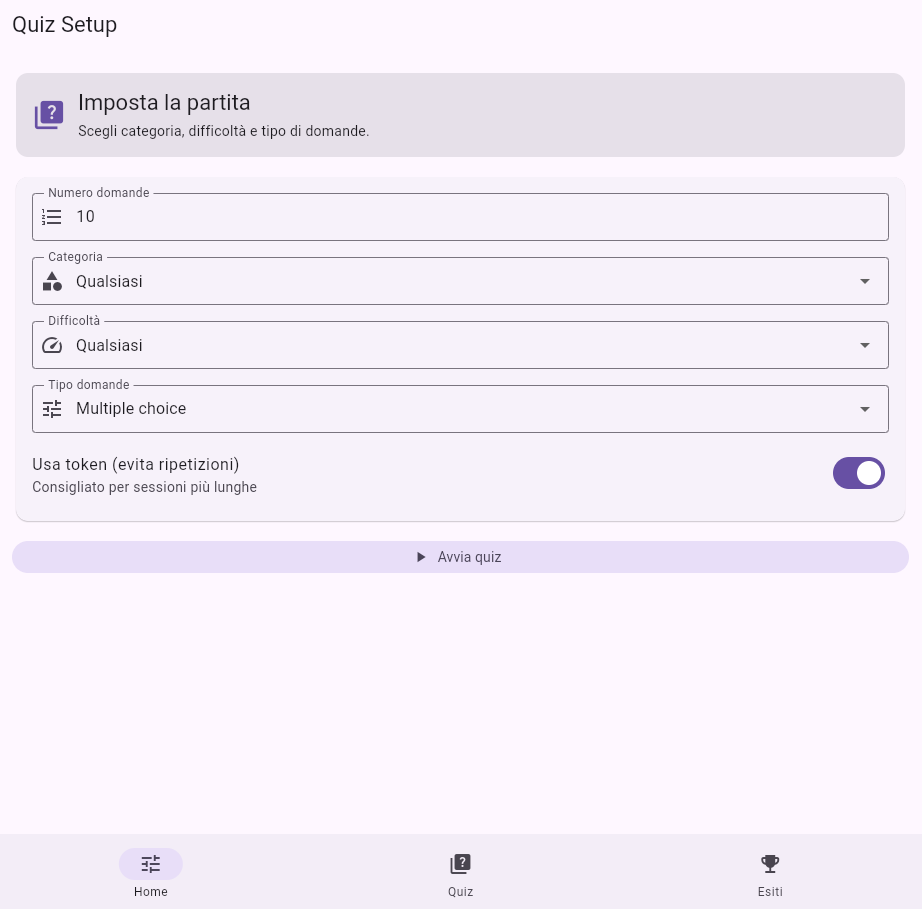
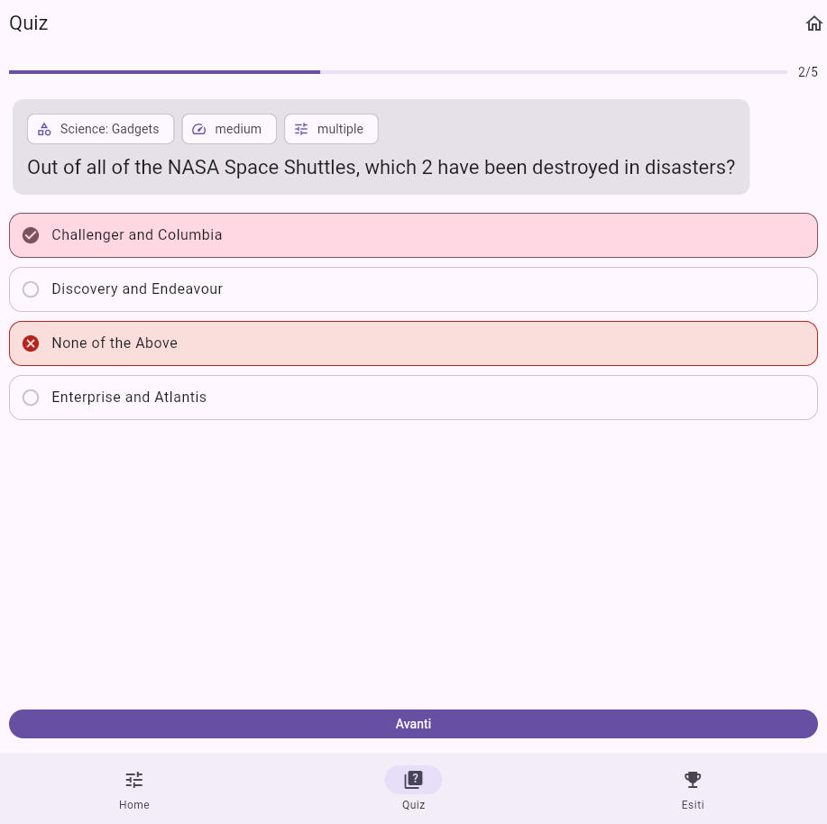
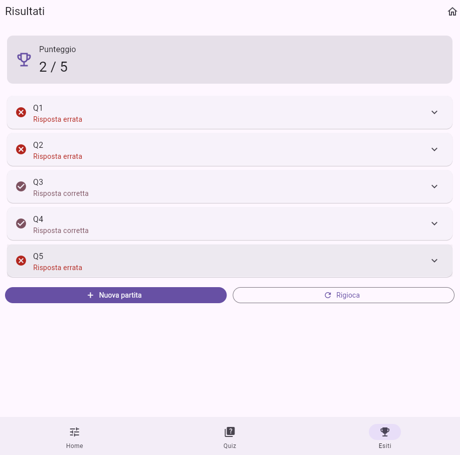
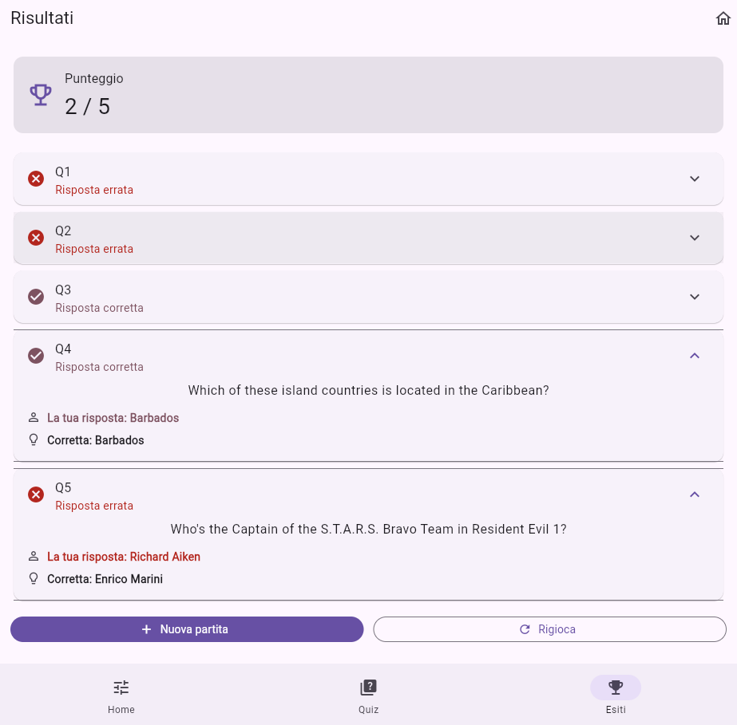

# Quiz Flutter — Documentazione Progetto

## Panoramica
Applicazione mobile sviluppata con Flutter che permette di giocare a un quiz basato su domande scaricate da **OpenTriviaDB**.  
L’app include una Home di configurazione, una schermata di gioco e una schermata di risultati con resoconto dettagliato della partita.

## Obiettivi del progetto
- Interrogare una REST API pubblica (OpenTriviaDB) per ottenere domande e categorie.
- Implementare navigazione a schede usando il sistema di routing (`go_router`).
- Implementare logica di gioco (validazione risposta, punteggio, avanzamento).
- Mostrare un resoconto finale con risposte date e risposte corrette.


## Funzionalità
### Caricamento domande
- Le domande vengono caricate tramite endpoint `https://opentdb.com/api.php`.
- Vengono gestiti: testo domanda, risposte errate, risposta corretta, metadati.
- Viene usato `encode=base64` per gestire caratteri speciali; i campi vengono decodificati lato client.

### Caricamento categorie
- La lista categorie viene caricata tramite endpoint `https://opentdb.com/api_category.php`.
- La Home mostra un dropdown con “Qualsiasi” + lista delle categorie.

### Navigazione a schede
- Le pagine sono divise in 3 tab:
  - Home (setup partita)
  - Quiz (partita in corso)
  - Risultati (resoconto)
- La navigazione è gestita con `StatefulShellRoute.indexedStack` per mantenere lo stato dei branch.

### Regole del gioco
- Ogni domanda assegna 1 punto se la risposta scelta coincide con la risposta corretta.
- Dopo aver risposto, la domanda viene “bloccata” per evitare doppie risposte.
- Il pulsante “Avanti” è abilitato solo dopo la selezione della risposta.

### Resoconto partita
- Nei risultati viene mostrato:
  - punteggio totale
  - lista di tutte le domande
  - risposta data dall’utente
  - risposta corretta
- Ogni domanda è mostrata in forma compatta e i dettagli sono espandibili.

## Tecnologie e dipendenze
### Flutter / Dart
```yaml
UI con Material 3
```

### Package
```yaml
dependencies:
  flutter:
    sdk: flutter
  http: ^1.2.0
  go_router: ^13.0.0
```

## Struttura del progetto
```
lib/
  main.dart

  app/
    router.dart

  data/
    opentdb_api.dart
    opentdb_models.dart

  logic/
    quiz_controller.dart
    quiz_scope.dart

  ui/
    pages/
      home_page.dart
      quiz_page.dart
      results_page.dart
```

### Spiegazione cartelle
- `app/`: configurazione routing e shell a tab.
- `data/`: chiamate HTTP e modelli dati.
- `logic/`: stato del gioco e condivisione del controller nella UI.
- `ui/`: pagine e widget di presentazione.

## Componenti principali

### 1) `OpenTdbApi` — Client HTTP
**File:** `lib/data/opentdb_api.dart`

Responsabilità:
- Costruire le URL verso OpenTriviaDB.
- Eseguire richieste HTTP GET.
- Parsare JSON.
- Gestire `response_code` con eccezione dedicata.

Metodi principali:
- `fetchQuestions(...)`: scarica le domande con filtri (amount, category, difficulty, type, token).
- `fetchCategories()`: scarica la lista categorie.
- `requestToken()`: ottiene un session token (opzionale).
- `resetToken(token)`: resetta il token.

### 2) Modelli — `Question` e `TriviaCategory`
**File:** `lib/data/opentdb_models.dart`

- `Question`: contiene domanda, opzioni (mischiate) e risposta corretta.
- `TriviaCategory`: contiene id e nome categoria; include un semplice “unescape” per `&amp;` ecc.

### 3) Logica — `QuizController`
**File:** `lib/logic/quiz_controller.dart`

Responsabilità:
- Gestire stati: `idle`, `loading`, `playing`, `finished`, `error`.
- Avviare una nuova partita (`startNewGame`).
- Registrare la risposta (`answer`).
- Passare alla domanda successiva (`next`).
- Salvare le risposte dell’utente (`userAnswers`) per i risultati.
- Caricare e cacheare le categorie (`loadCategories`).

### 4) Scope — `QuizScope`
**File:** `lib/logic/quiz_scope.dart`

- Espone `QuizController` a tutta l’app tramite `InheritedNotifier`.
- Permette di recuperare il controller in ogni pagina con `QuizScope.of(context)`.

### 5) Routing — `buildRouter()`
**File:** `lib/app/router.dart`

- Usa `GoRouter` + `StatefulShellRoute.indexedStack`.
- Configura 3 branch (Home/Quiz/Risultati).
- Blocca la tab Quiz se non c’è una partita attiva.
- Blocca la tab Risultati se la partita non è terminata.

## Pagine UI

### HomePage (Setup partita)
**File:** `lib/ui/pages/home_page.dart`

Contiene:
- Form con validazione del numero domande.
- Dropdown categoria (caricata da API).
- Dropdown difficoltà.
- Dropdown tipo (multiple/boolean).
- Switch token.
- Pulsante “Avvia quiz”.

#### Screenshot: Home / Setup


---

### QuizPage (Partita)
**File:** `lib/ui/pages/quiz_page.dart`

Contiene:
- Barra progresso (domanda corrente / totale).
- Card domanda con chip (categoria/difficoltà/tipo).
- Lista opzioni cliccabili con feedback (corretta/errata).
- Pulsante “Avanti” (abilitato solo dopo risposta).

#### Screenshot: Quiz (domanda)

---

### ResultsPage (Resoconto)
**File:** `lib/ui/pages/results_page.dart`

Contiene:
- Card punteggio.
- Lista domande con `ExpansionTile`:
  - titolo compatto Q1, Q2...
  - esito corretto/errato
  - dettaglio espandibile con domanda + risposta utente + corretta
- Pulsanti finali: “Nuova partita” e “Rigioca”.

#### Screenshot: Risultati (header)


#### Screenshot: Risultati (lista)


#### Screenshot: Risultati (dettaglio espanso)



## Avvio del progetto
1. Installare dipendenze:
   ```bash
   flutter pub get
   ```
2. Avviare su emulatore/dispositivo:
   ```bash
   flutter run
   ```


