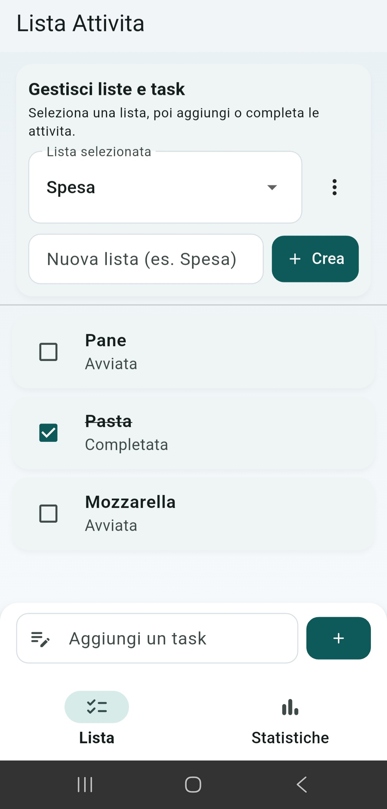
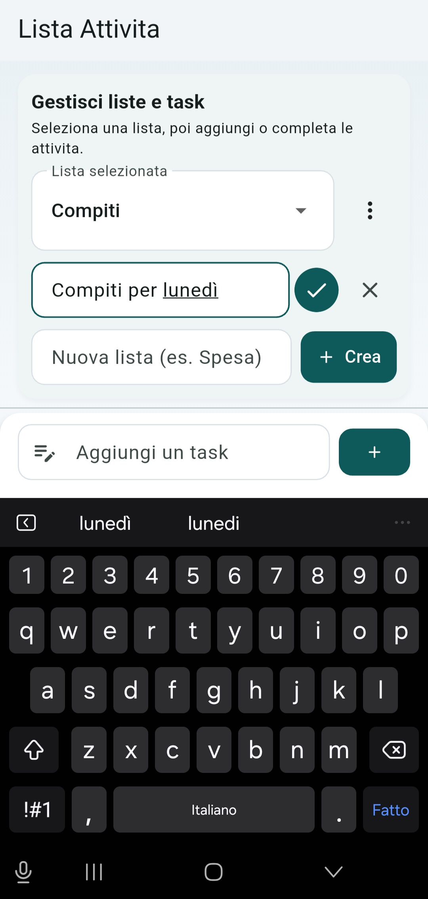
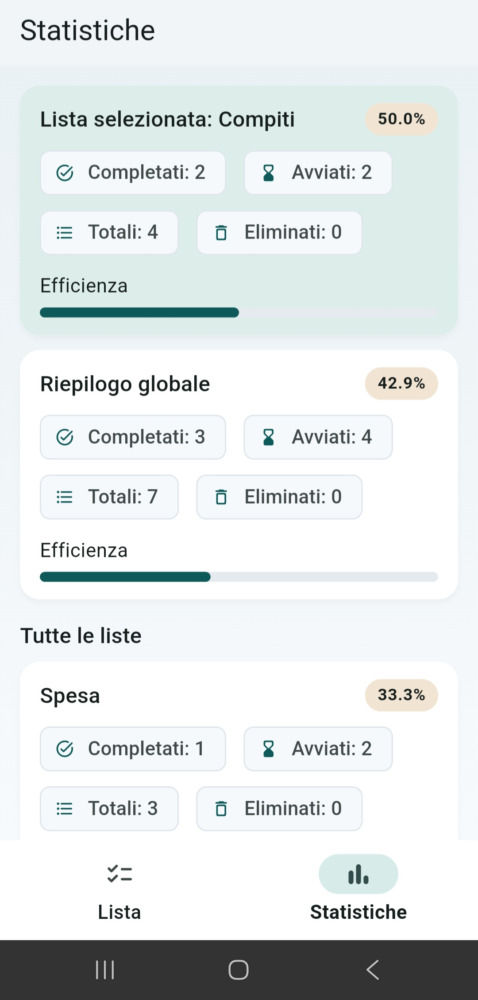

# TO DO List Multi-Lista (Flutter)

App Flutter per gestire task su piu liste (es. Spesa, Scuola, Lavoro), con statistiche per lista e riepilogo globale, persistenza locale e UI Material 3.

## Anteprima

### Home / Task


### Gestione Liste


### Statistiche


## Funzionalita principali

- Multi-lista: creazione, selezione, rinomina ed eliminazione liste
- Task per lista: aggiunta, completamento/non completamento, eliminazione
- Stato task:
  - Avviata (non completata)
  - Completata
  - Eliminata
- Statistiche:
  - Completati
  - Avviati (pendenti)
  - Totali
  - Eliminati
  - Efficienza (%)
- Due schermate principali con `BottomNavigationBar`:
  - `Lista`
  - `Statistiche`
- Persistenza locale dopo riavvio app

## Logica statistiche

- Le task eliminate **non vengono contate** nei totali attivi e nell'efficienza
- Formula efficienza: `completati / totali_attivi * 100`
- Se i totali attivi sono 0, efficienza = `0%`

## Stack tecnico

### State management: `Provider` + `ChangeNotifier`

Lo stato applicativo e centralizzato in `AppState` (file `lib/providers/app_state.dart`).

- `Provider` espone lo stato al widget tree
- `ChangeNotifier` notifica la UI quando i dati cambiano

In pratica, quando aggiungi/rinomini/elimini una lista o aggiorni una task, `AppState` salva il dato e aggiorna automaticamente le schermate `Lista` e `Statistiche` senza logica duplicata nei widget.

### Storage locale: `shared_preferences`

La persistenza e gestita da `StorageService` (`lib/services/storage_service.dart`) tramite `shared_preferences`, una soluzione leggera e adatta a questo tipo di progetto.

I dati restano disponibili anche dopo chiusura e riapertura dell'app, senza bisogno di backend o database esterno.

### Serializzazione dati: JSON

Le liste e le task vengono convertite in JSON tramite `toJson/fromJson` nei model:

- `TaskModel` (`lib/models/task_model.dart`)
- `TodoListModel` (`lib/models/todo_list_model.dart`)

Questo rende i dati semplici da salvare, leggere e mantenere nel tempo. Inoltre facilita eventuali evoluzioni future (esportazione, backup, sincronizzazione remota).

## Architettura del progetto

```text
lib/
  main.dart
  models/
    task_model.dart
    todo_list_model.dart
  providers/
    app_state.dart
  services/
    storage_service.dart
  screens/
    list_screen.dart
    stats_screen.dart
  widgets/
    stats_card.dart
```

## Modello dati

### Task

- `id: String`
- `title: String`
- `isDone: bool`
- `isDeleted: bool`
- `createdAtEpoch: int`

### TodoList

- `id: String`
- `name: String`
- `tasks: List<TaskModel>`

## Persistenza

I dati sono salvati in `shared_preferences` con queste chiavi:

- `todo_lists`: JSON contenente tutte le liste con le rispettive task
- `selected_list_id`: id della lista selezionata

Il flusso é semplice:

1. all'avvio, l'app legge i dati da storage
2. durante l'uso, ogni mutazione aggiorna lo stato in memoria
3. subito dopo, lo stato viene salvato in locale

Il salvataggio avviene a ogni mutazione principale:

- aggiunta/rinomina/eliminazione lista
- selezione lista
- aggiunta/completamento/eliminazione task

## Avvio del progetto

1. Installa le dipendenze:

```bash
flutter pub get
```

2. Avvia l'app:

```bash
flutter run
```

## Qualita del codice

- Codice organizzato in layer per la manutenibilitá
- Validazioni base su input (nomi/titoli vuoti non accettati)
- Gestione stati vuoti (nessuna lista, nessun task)
- Analisi statica e test base non causano errori

```bash
flutter analyze
flutter test
```
